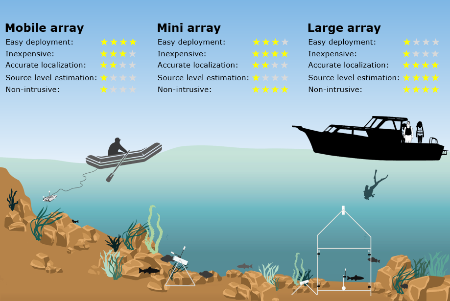

# Identification of fish sounds in the wild using a set of portable audio-video arrays

This repository contains the necessary information to assemble, operate, deploy, and process data from three eXperimental Audio-Video (XAV) arrays used for identifying fish sounds in the wild. 

## Authors
Xavier Mouy (1,2), Morgan Black (3), Kieran Cox (3), Jessica Qualley (3),Stan Dosso (1), and Francis Juanes (3)

1. School of Earth and Ocean Sciences, University of Victoria, 3800 Finnerty Road, Victoria, BC, V8P 5C2, Canada.
2. Integrated Statistics, Inc., under contract to National Oceanic and Atmospheric Administration, National Marine Fisheries Service, Northeast Fisheries Science Center, 166 Water Street, Woods Hole, MA 02543, United States of America.
3. Biology department, University of Victoria, 3800 Finnerty Road, Victoria, BC, V8P 5C2, Canada.

## Abstract
1. Associating fish sounds to specific species and behaviours is important for making passive acoustics a viable tool for monitoring fish. While recording fish sounds in tanks can sometimes be performed, many fish do not produce sounds in captivity. Consequently, there is a need to identify fish sounds *in situ* and characterise these sounds under a wide variety of behaviours and habitats.
2. We designed three portable audio-video platforms capable of identifying species-specific fish sounds in the wild: a large array, a mini array, and a mobile array. The large and mini arrays are static autonomous platforms than can be deployed on the seafloor and record audio and video for one to two weeks. They use multichannel acoustic recorders and low-cost video cameras mounted on PVC frames. The mobile array also uses a multichannel acoustic recorder, but mounted on a remotely operated vehicle with built-in video, which allows remote control and real-time positioning in response to observed fish presence. For all arrays, fish sounds were localised in three dimensions and matched to the fish positions in the video data. We deployed these three platforms at four locations off British Columbia, Canada.
3. The large array provided the best localisation accuracy and, with its larger footprint, was well suited to habitats with a flat seafloor. The mini and mobile arrays had lower localisation accuracy but were easier to deploy, and well suited to rough/uneven seafloors. Using these arrays, we identified, for the first time, sounds from quillback rockfish (\textit{Sebastes maliger}), copper rockfish (\textit{Sebastes caurinus}), and lingcod (\textit{Ophiodon elongatus}). In addition to measuring temporal and spectral characteristics of sounds for each species, we estimated mean source levels for lingcod and quillback rockfish sounds (115.4 and 113.5 dB re 1 uPa, respectively) and maximum detection ranges at two sites (between 10.5 and 33 m).   
4. All proposed array designs successfully identified fish sounds in the wild and were adapted to various budget, logistical, and habitat constraints. We include here building instructions and processing scripts to help users replicate this methodology, identify more fish sounds around the world, and make passive acoustics a more viable way to monitor fish.

## Purpose of this repository
This repository contains the necessary information to assemble, operate, deploy, and process data from three eXperimental Audio-Video (XAV) arrays used for identifying fish sounds in the wild.

## Assembly and deployment of the audio-video arrays
Building instructions and suggested deployment procedures can be found in the Supplementary Information of the paper. Deploymnet log sheets and and check lists can be found in the logsheets folder [here](https://github.com/xaviermouy/XAV-arrays/tree/main/logsheets/).

## Sample data
Two small sets of acoustic data from the large and mobile arrays are provided in this repository and used to show how the acoustic localization works (see section below). All the acoustic data used in the paper can be found on the OSF data repository of the paper.

* **Data from the large array**: [here](https://github.com/xaviermouy/XAV-arrays/tree/main/localization/large-array)
* **Data from the mobile array**: [here](https://github.com/xaviermouy/XAV-arrays/tree/main/localization/mobile-array)

## Acoustic localization
Acoustic localization is performed using either linearized inversion or fully non-linear inversion. We provide python code for both approaches. 

* **Linearized inversion**:
    * Jupyter Notebook: [here](https://github.com/xaviermouy/XAV-arrays/blob/main/localization/Localization_linearized_inversion.ipynb)
    * GoogleColab Notebook: *in the works*
	
* **Fully non-linear inversion**:
    * Jupyter Notebook: [here](https://github.com/xaviermouy/XAV-arrays/blob/main/localization/Localization_non-linear_inversion.ipynb)
    * GoogleColab Notebook: *in the works*

## Simulated annealing for optimizing hydrophones placement

* Jupyter Notebook: -> [here](https://github.com/xaviermouy/XAV-arrays/blob/main/localization/Optimization_of_hydrophone_placement.ipynb) 
* GoogleColab Notebook: *in the works*

